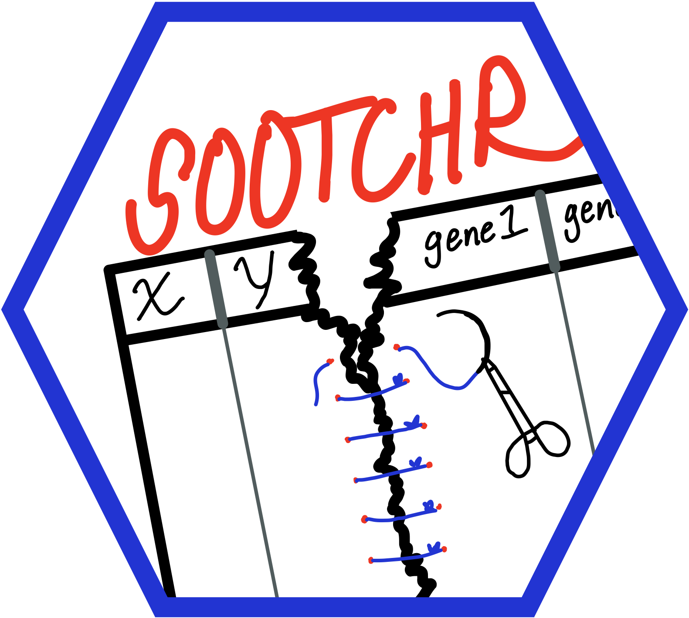

# sootchr </a>
`sootchr` stands for: Spatial Omics Operations for Trancriptional CHaracterization and Regression

This R package is a collection of functions designed for analyzing NanoString CosMx and GeoMx data. The functions are mainly intended to assist with vizualizations of spatial data and linear mixed modeling for differential expression analysis. 

Note: as of 6/1/2025, this package remains under construction.